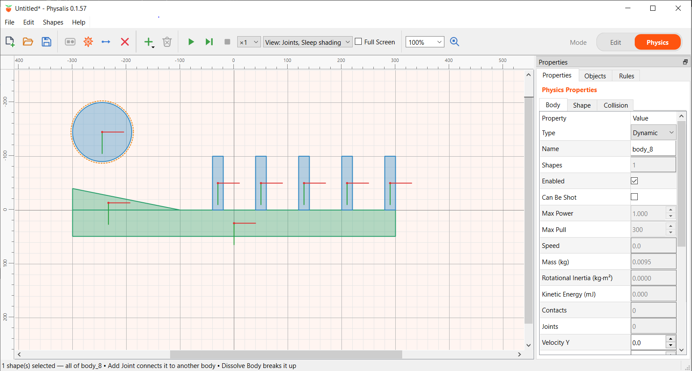

# Physalis

[](https://github.com/folibis/physalis/actions/workflows/build.yml)

Physalis is a desktop application for building and running two-dimensional
physics simulations. You draw shapes, group them into rigid bodies with their
own physical properties, connect them with joints such as hinges, sliders,
springs and motors, and run the scene. During a simulation you can push bodies
with forces and impulses, measure distances with rays, set off explosions, and
describe how the scene reacts to events with rules, for example *when the ball
enters the pocket, return it to the start*.

<p align="center">
  
</p>

**Documentation:** <https://folibis.github.io/physalis/>

## Features

- **Drawing:** rectangles, circles and polygons, with moving, resizing,
  rotating, point editing, snapping to a grid, and undo.
- **Bodies:** dynamic, static and kinematic bodies made of one or more shapes,
  with density, friction, bounciness, damping, sensors and collision groups.
- **Joints:** hinges, sliders, wheels, springs, ropes, welds, motors, gears and
  more, depending on the engine.
- **Rules:** react to contacts, sensors, joint limits, time and property values
  by changing properties or performing actions, with no programming.
- **Running:** play, pause and step, playback from ×¼ to ×8, full-screen mode,
  a live log of chosen values, and a slingshot for flinging bodies with the
  mouse.
- **Physics engines as plugins:** Physalis itself does not simulate anything.
  It comes with plugins for [Box2D](https://box2d.org) and
  [Chipmunk2D](https://chipmunk-physics.net), and further engines can be added
  as plugins.
- **Export:** turn a scene into a standalone Box2D/Qt C++ project or a
  Planck.js web page. Export formats are JavaScript plugins, so new ones can be
  added without rebuilding.

## Building

Physalis is written in C++17 with Qt 6. It builds with CMake; Box2D,
Chipmunk2D and GoogleTest are downloaded during configuration.

```bash
cmake -S . -B build
cmake --build build
ctest --test-dir build
```

The program and the engine plugins end up in `build/`. For installers and
packages (an NSIS installer or ZIP on Windows, DEB or TGZ on Linux),
configure a Release build and run `cpack` in the build folder.

## Documentation

The user guide is published at <https://folibis.github.io/physalis/> and its
sources are in [`docs/`](docs/). It covers drawing shapes, bodies and their
properties, joints, rules, running simulations, physics engine plugins,
writing your own exporters, and the options.
