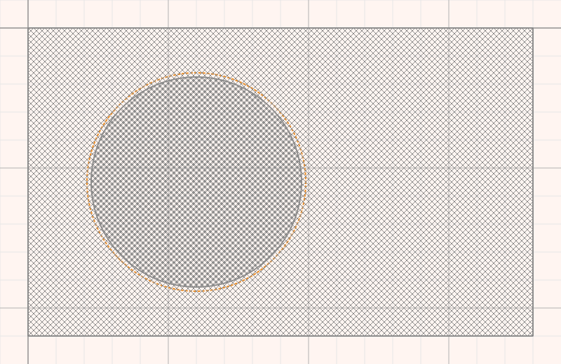

# Drawing shapes

Shapes are drawn in **Edit** mode. Switch to it with the **Edit** button on the
right of the toolbar.

## Adding shapes

Press **Add** on the toolbar and choose:

- **Rectangle**
- **Circle**
- **Polygon**: click on the canvas to place each point.
  - **Enter** finishes the shape.
  - **Shift+Enter** finishes it as a closed shape.
  - **Esc** cancels it.

Every shape gets a name, such as `circle_3`. Rules refer to shapes and bodies by
name, so it is worth renaming the ones you will use: select the shape and type
a new **Name** in the Properties tab.

## Selecting, moving and resizing

| To | Do |
|---|---|
| Select a shape | Click it |
| Move it | Drag it |
| Resize it | Drag one of its handles |
| Ignore the grid while dragging | Hold **Shift** |
| Select several shapes | **Shift+click** each one; they move, resize and rotate together |
| Rotate | Double-click the shape, or press **Rotate** on the toolbar |
| Edit a polygon's points | Press **Edit** on the toolbar |
| Go back to moving and resizing | Press **Move / Scale** |
| Nudge by one unit | Arrow keys (this never snaps to the grid) |
| Delete | **Delete** key, or the delete button on the toolbar |
| Deselect | Click empty space |

The status bar always says what the current selection lets you do.

## Shapes that overlap

A click selects the shape on top. To reach a shape underneath, **Ctrl+click**
on the same spot: each Ctrl+click steps one shape further down, then back to
the top.

A plain click on the shape you reached keeps it selected, even though another
shape lies over it, so you can drag it.

This works the same way in Physics mode.

## Shape properties

With a shape selected, the **Properties** tab has two pages:

- **Geometry**: Name, Width, Height, Corner Radius, Left, Top and Rotation.
- **Appearance**: border and fill.

A small reset arrow beside a value puts it back to its default.

## Zoom, grid and snapping

- The zoom box on the toolbar sets the scale. **Shift+mouse wheel** over the
  canvas zooms too.
- Dragging empty canvas pans the field.
- The grid, snapping and the field's size are set in
  [Options → Common](options.md).
