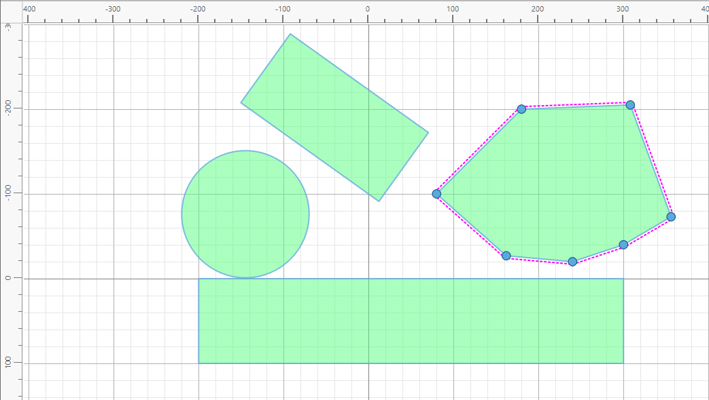

# Drawing shapes

Shapes are drawn in **Edit** mode, which you switch to with the **Edit** button
on the right of the toolbar. A shape is the drawing of an object: its outline,
size, position and colour. It takes no part in a simulation until it is made
into a body in [Physics mode](physics.md), so this is the place to get the
geometry right first.

## Kinds of shapes

Physalis has three kinds of shapes:

- **Rectangle**: a box with a width and a height. Its corners can be rounded
  with **Corner Radius**. A rectangle can be turned into a polygon (right-click
  it and choose **Convert to Polygon**) when you want to move its corners
  individually.
- **Circle**: set by its **Radius**. Circles roll, which makes them the natural
  choice for balls and wheels.
- **Polygon**: any outline made of straight edges. A polygon can be
  **closed**, so the last point joins the first, or **open**, like a line
  drawn through a series of points. What a polygon can do in a simulation
  depends on its outline:
  - A closed, **convex** polygon (no corners pointing inwards) can be a solid
    object that moves, falls and collides.
  - Any other outline, such as an open line or a closed shape with a notch, is
    treated as a set of edges. Edges are fine for fixed scenery such as ramps,
    walls and terrain, but they have no inside and therefore no mass, so they
    cannot belong to a body that moves. To make such a shape move, split it
    into several convex pieces and group them into one body.

## Adding shapes

Choose **Rectangle**, **Circle** or **Polygon** from the **Add** button on the
toolbar or from the **Shapes** menu, or right-click an empty part of the canvas
and choose from **Add**. A rectangle or circle appears at once and is
selected, ready to be moved and sized.

A polygon is drawn point by point: click on the canvas at each corner. Then:

- press **Enter** to finish it as an open line,
- press **Shift+Enter** to finish it as a closed shape,
- press **Esc** to cancel it.

Every new shape gets a name such as `rectangle_3`. The name matters later,
because [rules](rules.md) refer to objects by name. It is worth giving
meaningful names, such as `floor` or `ball`, to the shapes you will use in rules.
Rename a shape in the **Name** field of its properties. Names must be unique,
and Physalis adjusts a name that is already taken.

## Selecting

- **Click** a shape to select it. It is outlined and gets handles.
- **Shift+click** adds shapes to the selection, or removes them from it.
  Shapes selected together move, resize and rotate together.
- **Click an empty part of the canvas** to clear the selection.
- **Ctrl+click** reaches a shape lying under another one: each Ctrl+click on
  the same spot selects the next shape down.
- **Click a shape in the Objects tab** to select it from the tree.

## Moving, resizing and rotating

A selected shape is in one of three states. **Double-click** the shape to go
from one state to the next, or use the buttons on the toolbar.

1. **Move / Scale** (the normal state). Drag the shape to move it, and drag one
   of the square handles around it to resize it.
2. **Rotate**. The shape shows its **origin**, the point it turns about, and a
   rotation handle. Drag the handle to turn the shape. The origin can be moved
   too, with **Origin X** and **Origin Y** in the properties or from
   **Move Origin To** in the right-click menu.
3. **Edit** (polygons only). Each corner point becomes a handle that can be
   dragged on its own, so you can reshape the outline.

More ways to move a shape:

- **Arrow keys** move the selection by one unit at a time.
- **Shift** while dragging ignores the grid, so the shape can be placed
  anywhere.
- **Left**, **Top** and **Rotation** in the properties place a shape exactly.
  Rotation is in degrees, clockwise.

## The right-click menu

Right-clicking a shape offers these commands:

- **Duplicate** makes a copy next to the original.
- **Flip Horizontally** and **Flip Vertically** mirror the shape.
- **Convert to Polygon** (rectangles only) replaces the rectangle with a polygon
  of the same outline.
- **Move to Center** moves the shape to the middle of the field.
- **Move Origin To** puts the turning point at the centre or at one of the
  corners.
- **Snap to Grid** and **Snap To** decide whether the shape lines up with the
  grid when moved, and whether its top-left corner or its origin is the point
  that snaps.
- **Reset Rotation** turns the shape back to 0°.
- **Delete** removes the shape. The **Delete** key does the same.

## Shape properties

With a shape selected, the **Properties** tab shows two pages.

**Geometry** holds the shape's name, position and size: **Left** and **Top**
(the position of its top-left corner on the field), **Width** and **Height**
(or **Radius** for a circle), **Corner Radius** for a rectangle, and
**Rotation**.

A polygon has three more rows, which decide how the outline is built for the
simulation:

- **Built as** offers only the choices the outline allows:
  - **Polygon**: one solid, filled shape. It is the only choice with an
    inside, and so the only one that can belong to a moving body. It needs a
    closed, convex outline within the point limit set in
    [Options → Physics](options.md).
  - **Chain**: the edges joined into one smooth surface, so that nothing
    catches where two edges meet. A chain stops things from one side only and
    needs at least four points. It suits terrain and curved ramps.
  - **Segments**: each edge on its own. Segments stop things from both sides,
    but something sliding along them can catch at a joint.
- **Segments** shows how many edges the outline is built from.
- **Filled** chooses whether a solid polygon is drawn filled or as an outline.

**Appearance** controls only how the shape is drawn and has no effect on the
simulation:

- **Body Color** is the fill colour, and **Transparency** is how much of what
  lies behind shows through it.
- **Border Width** and **Border Color** set the outline.
- **Line Cap** and **Line Join** set how the ends and corners of the outline
  are drawn. They matter mostly for open polygons.

The default colours and outline for new shapes are set in
[Options → Shapes](options.md).

## Zoom, grid and snapping

- The zoom box on the toolbar sets the scale of the view: pick a preset or
  type a value. **Shift + mouse wheel** over the canvas zooms as well, and the
  magnifier button returns to 100%.
- Drag an empty part of the canvas to move the view.
- The field's size and colour, the grid, and how snapping works are set in
  [Options → Common](options.md). The field's size and colour can also be
  changed for the current scene in its properties: click an empty part of the
  canvas to show them.
