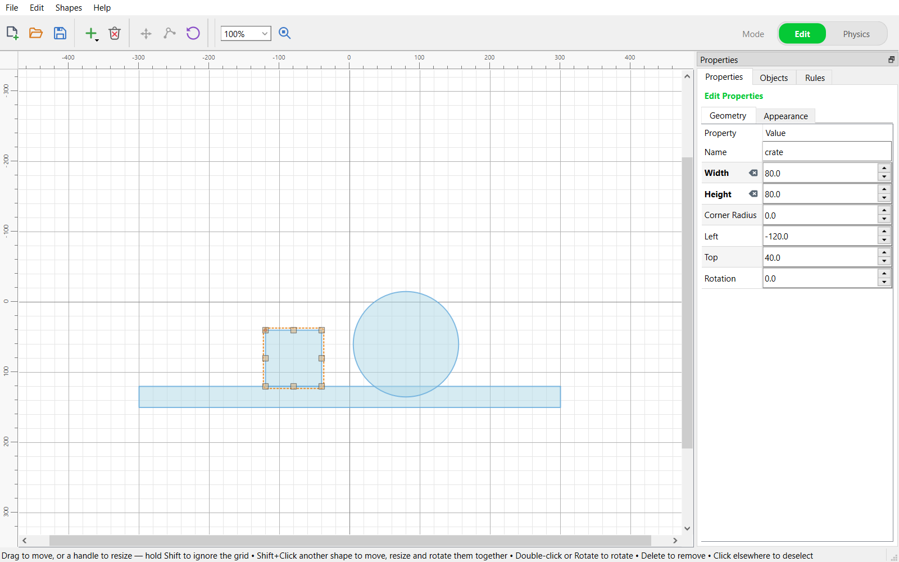

# Physalis

Physalis is a desktop application for building 2D physics scenes and running
them. You draw shapes, group them into bodies, connect them with joints, add
rays, sensors and explosions, and write rules that react to what happens:
*when the ball enters the pocket, remove it*.

The physics itself comes from a plugin. Physalis ships with two:
**Box2D** and **Chipmunk2D**.

## The window

| Part | What it is for |
|---|---|
| **Toolbar** | New, open and save; the tools for the current mode; zoom; and on the right, the **Edit / Physics** mode switch |
| **Canvas** | The field you build the scene on, with rulers along the top and left |
| **Properties** tab | Everything about what is selected; with nothing selected, the field and the world |
| **Objects** tab | Every shape, body, joint, ray and explosion in the scene, as a tree |
| **Rules** tab | The rules that run during a simulation |
| **Status bar** | What you can do right now with the current selection |

## Two modes

- **Edit** mode is for drawing: add shapes, move, resize and rotate them,
  edit a polygon's points, and set how they look. See [Drawing shapes](editing.md).
- **Physics** mode is for making the shapes behave: group them into bodies,
  choose what each body is made of, add joints, rays and explosions, and run
  the simulation. See [Bodies and physics](physics.md).

## A scene, start to finish

1. In **Edit** mode, add the shapes: a floor, a box, a ball.
2. Switch to **Physics** mode, select shapes and press **Create Body**.
   Make the floor **Static** so it stays put.
3. Connect bodies with [joints](joints.md) if they should move together.
4. Add [rules](rules.md) for anything that should happen during the run.
5. Press **Simulate**. See [Running a simulation](running.md).
6. **Stop** puts everything back exactly where it was.

## Files

Scenes are saved as `*.phys` files. A scene remembers which physics engine it
was built for, and opens with that engine.

| Menu | Command | Shortcut |
|---|---|---|
| File | New Scene | Ctrl+N |
| File | Load Scene… | Ctrl+O |
| File | Save Scene | Ctrl+S |
| File | Save Scene As… | Ctrl+Shift+S |
| File | Export to → … | |
| File | Options… | |
| Edit | Undo | Ctrl+Z |
| Edit | Redo | Ctrl+Y |
| Edit | Copy | Ctrl+C |
| Edit | Paste | Ctrl+V |

## Pages

- [Drawing shapes](editing.md)
- [Bodies and physics](physics.md)
- [Joints](joints.md)
- [Rules](rules.md)
- [Running a simulation](running.md)
- [Physics engines](engines.md)
- [Exporting](exporting.md)
- [Options](options.md)
