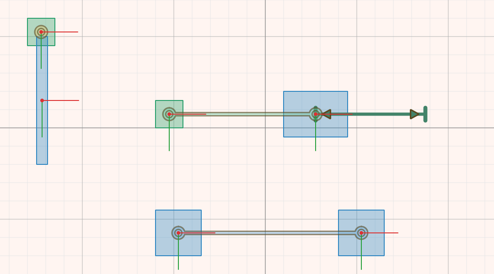

# Joints

A joint connects two bodies and limits how they can move relative to each
other. A door hinge lets a door turn but not come away from the frame; a
drawer runner lets a drawer slide in one direction only; a rope keeps two
things from moving too far apart. Joints are how separate bodies become
machines: pendulums, cars, cranes, catapults and chains.

## Adding a joint

1. In **Physics** mode, click a shape of the first body, then **Shift+click** a
   shape of the second body.
2. Press **Add Joint** on the toolbar and choose the type of joint.
3. The joint appears with its **anchors**, the small rings that mark where it
   holds each body. Drag the anchors to the right places, for example to the
   centre of a wheel for an axle.

The first body you selected is **body A** and the second is **body B**. For
most joints the order makes no difference, but for some it does (see
[Wheel joints](#wheel-joints-chassis-first) below). A few joint types, such as
**Mouse**, hold a single body to a point in the world, and need only one body
selected.

Right-clicking a joint offers quick ways to place its anchors, such as
**Move Anchor to *body* Center** or **Move Both Anchors to Their Centers**.

To remove a joint, select it and press **Delete Joint**.

## Joint types

The joint types depend on the scene's [physics engine](engines.md).

**Box2D** offers:

- **Revolute**: pins two bodies together at one point and lets them turn
  about it. Use it for hinges, axles and pendulums.
- **Distance**: keeps two points a set distance apart, like a rigid rod. With
  a spring it becomes a shock absorber; with a minimum and maximum length it
  becomes a rope.
- **Weld**: fixes two bodies firmly together. With a spring frequency the
  join becomes slightly flexible.
- **Prismatic**: lets body B slide along one straight line relative to body
  A, and nothing else. Use it for pistons, lifts and drawer runners.
- **Wheel**: lets a wheel spin freely while it slides along a spring axis on
  the chassis. It is made for vehicle suspension.
- **Motor**: drives body B to keep a set position and angle relative to
  body A.
- **Mouse**: pulls a point on a single body softly towards a target point.
- **Filter**: holds nothing; it only stops the two bodies from colliding with
  each other.

**Chipmunk2D** offers:

- **Pivot**: pins two bodies together at a point, like Box2D's Revolute.
- **Pin**: a rigid rod hinged at both ends.
- **Slide**: keeps two points between a minimum and a maximum distance. With
  no minimum, it behaves like a rope.
- **Groove**: a slot in body A along which a pin on body B runs.
- **Damped Spring**: a spring with a shock absorber between two points.
- **Rotary Spring**: a torsion spring that turns body B back towards a set
  angle.
- **Rotary Limit**: stops body B from turning beyond a range of angles.
- **Ratchet**: lets body B turn in one direction only.
- **Gear**: makes the two bodies turn together at a fixed ratio.
- **Simple Motor**: turns body B at a steady rate.
- **Mouse**: pulls a point on a body towards a target point.

## Joint properties

Select a joint (click it on the canvas or in the **Objects** tab) and its
settings appear in the **Properties** tab.

- **Body A** and **Body B** name the two bodies it connects.
- **Bodies Collide** decides whether the two connected bodies can still bump
  into each other. It is off by default, which is usually what you want.
  Watch out, though: if one of the bodies is scenery such as the floor, the
  other one then falls straight through it. Tick the box in that case.
- The anchor positions, in field coordinates.
- The joint's own settings, grouped under headings:
  - **Spring**: how stiff (**Frequency**, in Hz) and how quickly it stops
    bouncing (**Damping Ratio**: 0.7 is a good start; 1 stops without bouncing).
    Doubling the frequency makes the spring four times stiffer.
  - **Limit**: the range the joint may move within, such as the angles a hinge
    may turn through or how far a slider may travel.
  - **Motor**: a motor that drives the joint at a set **Motor Speed**, with no
    more than a set maximum force or torque.
- **Measured** readings show what the joint is doing: its current angle or
  travel, how fast it is moving, and how hard it is holding. They show starting
  values before a simulation and live values during one, and can be added to
  the log with a right-click.

## Things worth knowing

### Sliding joints measure from where they start

For **Prismatic** and **Wheel** joints, the limits are measured as travel from
where the joint is when the simulation starts, along its axis. A range of
**0 to 120** lets body B slide up to 120 units along the axis. The shaded band
drawn along the axis shows this range, starting from **anchor B**.

If body A is the one that moves, sliding towards body B counts as negative
travel. Swap the bodies, or use a negative range.

### Motors can overpower limits

A limit is not a solid wall; it is a condition the engine tries to keep. A
motor with a very large maximum force can push straight through it. At the
usual scale, bodies weigh only grams, and tenths of a newton are already
strong. Start with a small force and increase it until the joint moves as you
want.

To make a motor go back and forth, use a [rule](rules.md): when the joint
reaches its limit, **Negate** its **Motor Speed**.

### Wheel joints: chassis first

For a **Wheel** joint, **body A must be the chassis** and **body B the wheel**.
The suspension axis belongs to body A. With the bodies the other way round,
the axis turns with the wheel and the suspension points in the wrong
direction.

## How joints are drawn

Joints are coloured by what they do, so a scene reads the same whichever
engine it uses: **turning** joints (hinges), joints that **hold a length**
(rods, ropes, springs), **sliding** joints, **fixed** joints, and joints
**without anchors** (such as gears). Each kind's colour and line style, and how
transparent the anchors are, can be changed in
[Options → Joints](options.md).
