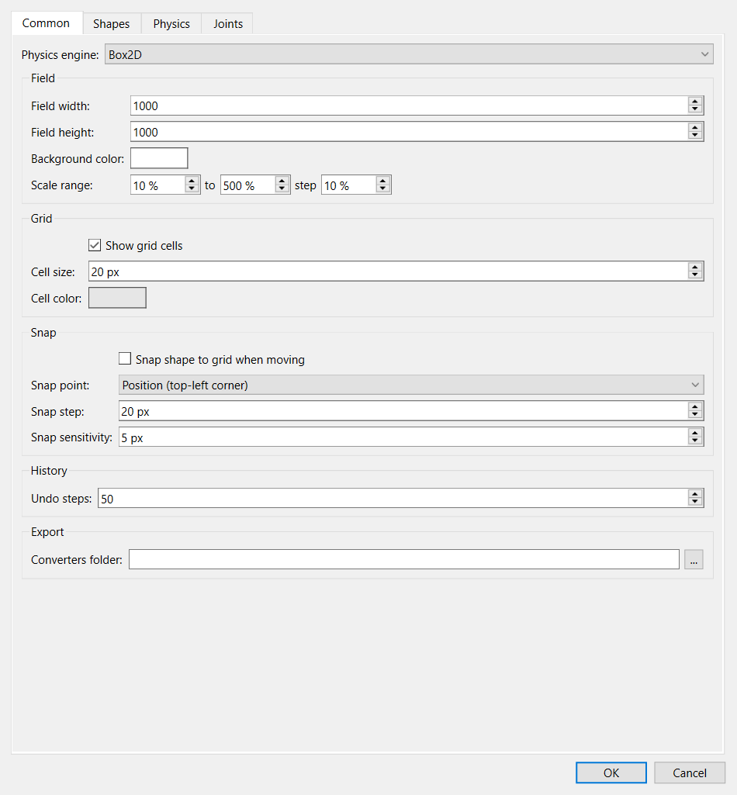
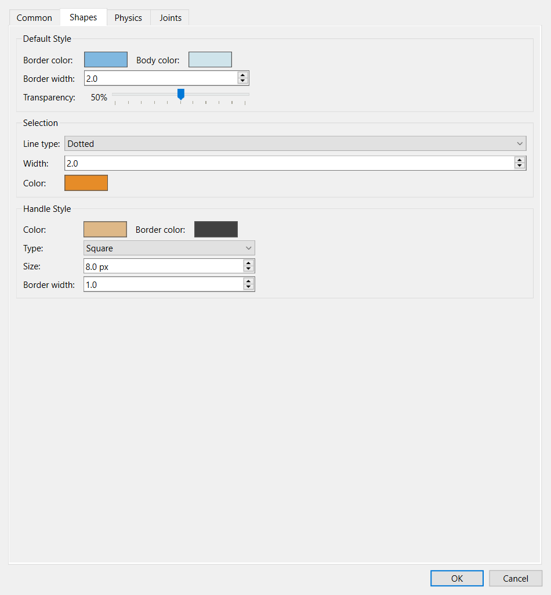
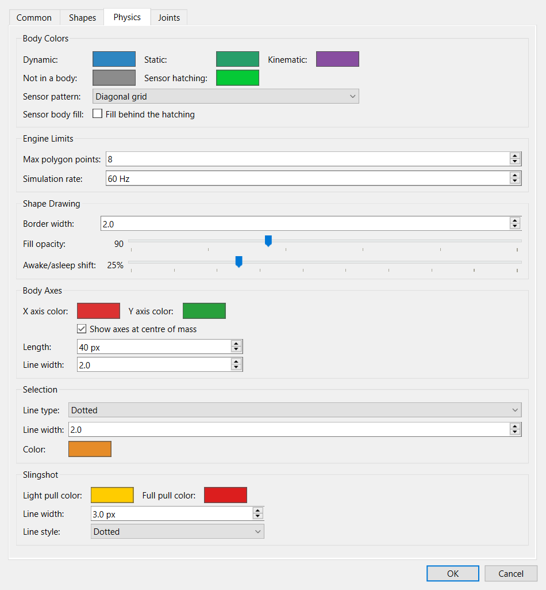
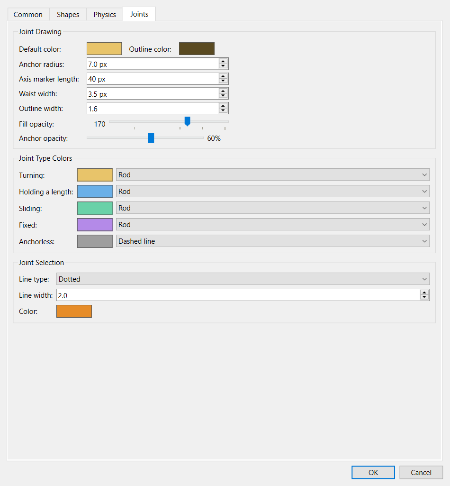

# Options

**File → Options…** holds the application's settings. They are saved when you
press OK and apply to every scene, now and in future sessions. Settings that
belong to a single scene, such as its gravity or scale, are not here; you find
them in the scene's own properties, shown when nothing is selected.

## Common

- **Physics engine** chooses the [engine](engines.md) that new scenes use.
- **Field** sets the default size and background colour of the field for new
  scenes, and how far you can zoom in and out.
- **Grid** sets whether the grid is shown, the size of its cells and its
  colour.
- **Snap** decides whether shapes line up with the grid when they are moved,
  which point of a shape lines up (its top-left corner or its origin), the
  snap step, and how close a shape has to come before it snaps.
- **History** sets how many steps **Undo** can go back.
- **Converters folder** is where the [export](exporting.md) formats are found.

## Shapes

The colours and outline that new shapes are drawn with, how a selected shape
is outlined, and the size and colour of the handles used to resize and rotate
shapes.

## Physics

- **Body Colors** are the colours used for dynamic, static and kinematic bodies,
  for shapes that are not in a body, and for the hatching of sensors.
- **Engine Limits** sets the largest number of points a solid polygon may have
  and the rate at which the simulation is calculated.
- **Shape Drawing** sets how bodies are outlined and filled, and how strongly
  **Sleep shading** tints bodies that have come to rest.
- **Body Axes** controls the centre-of-mass cross drawn on each body: whether it
  is shown, and its colours, length and width.
- **Selection** sets how a selected body is outlined.
- **Slingshot** sets the colour of the pull line for a light pull and for a
  full pull, its width and its style. See [the slingshot](running.md#the-slingshot).

## Joints

- **Joint Drawing** sets how joints are drawn: their colours, the size of the
  anchor rings, and how transparent the anchors are (**Anchor opacity**), so
  the shapes under them stay visible.
- **Joint Type Colors** gives each kind of joint its own colour and line
  style: turning, holding a length, sliding, fixed, and without anchors.
- **Joint Selection** sets how a selected joint is outlined.

## Export

One page for each [export format](exporting.md), holding that format's own
settings.
