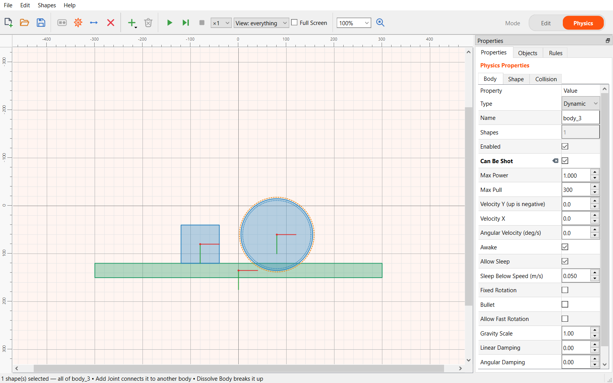
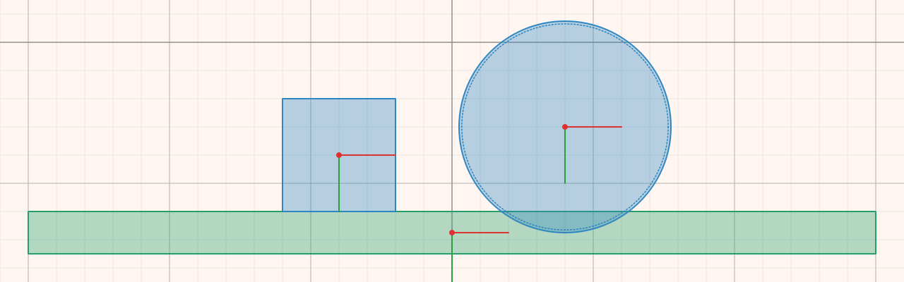
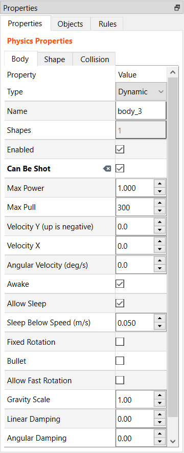
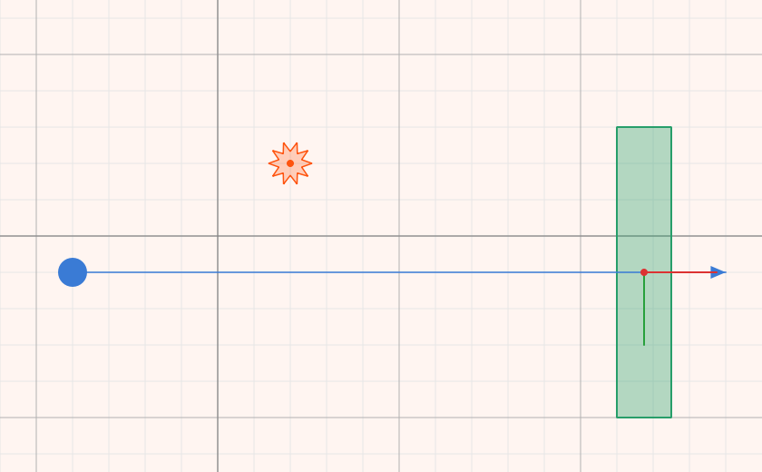

# Bodies and physics

Shapes do nothing on their own. To take part in a simulation, a shape has to
belong to a **body**. Bodies are made in **Physics** mode: switch to it with
the **Physics** button on the right of the toolbar.

## Making bodies

1. Click a shape. **Shift+click** to add more shapes to the selection.
2. Press **Create Body**. The selected shapes become one rigid body that moves
   as a whole.

Double-clicking a shape that is not in a body also makes it a body.

To break a body back into loose shapes, select it and press **Remove** on the
toolbar.

## Body types

The colour of a body shows its type:

| Type | Colour | Behaviour |
|---|---|---|
| **Dynamic** | blue | Fully simulated: falls, collides, is pushed around |
| **Static** | green | Never moves. Use it for floors, walls and scenery |
| **Kinematic** | purple | Moves only as it is told, and is not pushed by anything |
| Not in a body | grey, hatched | Takes no part in the simulation |

The small red and green cross on a body marks its centre of mass, which is
also where it turns.

## Body and shape properties

Select a body and the **Properties** tab shows three pages:

- **Body**: type, name, whether it is enabled, velocity, damping, gravity
  scale, sleeping, and more.
- **Shape**: what the shape is made of, such as density, friction and
  restitution (bounciness).
- **Collision**: what it collides with.

Which rows appear depends on the [physics engine](engines.md) the scene uses.
Each engine offers its own properties.

Useful ones:

- **Enabled**: switched off, the body is left out of the simulation entirely.
- **Linear Damping**: how quickly a body slows down by itself. Useful for
  things sliding on a surface seen from above, such as pool balls.
- **Bullet**: stops a fast body from passing through thin walls.
- **Restitution**: 0 does not bounce at all; close to 1 bounces almost fully.

### Sensors

Tick **Sensor** on a shape and it no longer blocks anything: things pass
through it, and a rule can react when something enters or leaves it. Sensors
are drawn hatched.

For a rule on a sensor, use the **is entered** and **is left** events.
**begins contact** never fires on a sensor.

### Collision groups

On the **Collision** page:

- **Belongs To**: which groups this shape is part of, as the sum of their
  numbers: 1, 2, 4, 8 and so on.
- **Collides With**: which groups it hits.
- **Group Override**: shapes sharing a number above zero always collide;
  shapes sharing a number below zero never do. Zero leaves it to the two rows
  above.

Two shapes collide only when each one's group is in the other's **Collides With**.

### Shooting a body

A **dynamic** body also has these rows:

- **Can Be Shot**: during a run you can fling it with the mouse.
- **Max Power**: the push at full pull.
- **Max Pull**: how far you pull for full power.

See [Running a simulation](running.md#the-slingshot).

## Rays and explosions

- **Add Ray** places a rangefinder. It looks in one direction up to its
  **Length**, and reports **Distance**, **Hit**, **Hit X** and **Hit Y**. A
  rule can react to what it detects.
- **Add Explosion** places a blast. It does nothing until a rule sets it off
  with the **Explode** action.

## The field and the world

With nothing selected, the **Properties** tab shows the field and the world:
its size, background and grid, **Pixels per Meter** (the scale), **Solid Field
Bounds** (walls round the edge of the field), and the engine's world settings
such as gravity. For a table seen from above, set gravity to 0.
