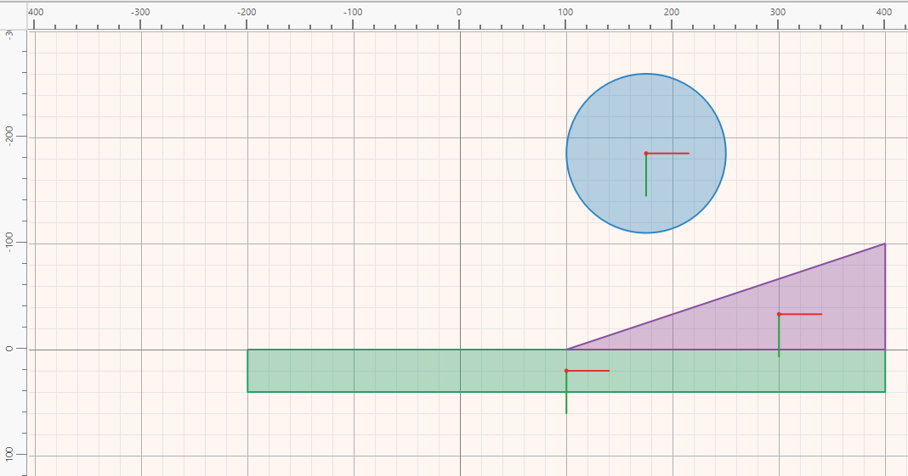

# Bodies and physics

A shape on its own is only a drawing. To take part in a simulation, a shape has
to belong to a **body**. A body is a rigid object: it can move and turn, but it
never bends or breaks, and all of its shapes keep their places relative to one
another. A body can be made of a single shape, such as a ball, or of several,
such as a cart made of a box and a handle.

Bodies are made and set up in **Physics** mode. Switch to it with the
**Physics** button on the right of the toolbar.

## Making a body

- **Double-click** a shape that is not yet in a body. It becomes a **dynamic**
  body, one that falls and can be pushed.
- **Ctrl+double-click** it instead to make a **static** body, one that never
  moves. Use this for floors, walls and other scenery.
- To make one body out of several shapes, click the first shape,
  **Shift+click** the others, and press **Create Body** on the toolbar.

To break a body back into separate shapes, select it and press **Remove** on
the toolbar. The shapes stay where they are and can be grouped again.

A shape that has no inside, such as an open polygon, a chain or a set of
segments (see [Drawing shapes](editing.md#shape-properties)), also has no mass.
A body made of such shapes is created as static, and Physalis explains why.

## Body types

Every body has a **Type**, shown by its colour on the canvas:

- **Dynamic** (blue): fully simulated. It falls under gravity, collides with
  other bodies, bounces, slides and can be pushed by forces, impulses and
  explosions. Most things that move are dynamic.
- **Static** (green): never moves, whatever hits it. Floors, walls, ramps and
  pockets are static. Static bodies cost almost nothing to simulate.
- **Kinematic** (purple): moves only as it is told, at the velocity you give
  it, and is never pushed back by anything it hits. Use it for moving platforms,
  lifts and conveyor parts.

Shapes that are not in any body are drawn grey and hatched, and take no part in
the simulation.

Each body shows a small red and green cross. It marks the body's **centre of
mass**, which is where it balances and the point it turns about. Its position
is worked out from the shapes and their density.

## Body properties

Select a shape of a body, and the **Properties** tab shows three pages:
**Body**, **Shape** and **Collision**. Which rows appear depends on the
[physics engine](engines.md) the scene uses. The descriptions below use the
names shown by Box2D, the default engine. Hover over any row for an
explanation.

### The Body page

This page describes the body as a whole.

- **Type**, **Name** and **Enabled**. A disabled body is left out of the
  simulation entirely, as if it had been deleted, but it stays in the scene.
- **Shapes** says how many shapes the body is made of.
- **Velocity X**, **Velocity Y** and **Angular Velocity** give the body a
  starting motion, so that it is already moving when the simulation begins.
- **Linear Damping** and **Angular Damping** slow the body down over time, as
  air resistance or rolling friction would. Damping suits things seen from
  above, such as pool balls on a table. A value around 0.5 to 1 already makes a
  clear difference.
- **Gravity Scale** multiplies the world's gravity for this body only: 0 makes
  it float, 2 makes it fall twice as fast.
- **Fixed Rotation** stops the body from turning, which suits characters that
  must stay upright.
- **Bullet** makes the engine check a fast body more carefully, so that it
  cannot pass through a thin wall between two steps.
- **Allow Sleep**, **Awake** and **Sleep Below Speed** control sleeping. A body
  that has come to rest is put to sleep, and the engine stops calculating it
  until something touches it. This saves time and changes nothing you can see.
- **Can Be Shot**, **Max Power** and **Max Pull** set up the slingshot for this
  body. See [Running a simulation](running.md#the-slingshot).

The body's greyed-out rows are **readings**, which you can look at but not
change:

- **Mass** and **Rotational Inertia**, worked out from the shapes' size and
  density.
- **Speed**, how fast the body is moving in any direction.
- **Kinetic Energy**, in millijoules. At the usual scale bodies weigh only
  grams, so joules would read as zero.
- **Contacts**, how many other shapes the body is touching.
- **Joints**, how many joints are attached to it.

Before a simulation, the readings show what the body starts with. During a
simulation, they follow it live. Right-click any of them and choose **Add to
Log** to watch it change while the simulation runs.

### The Shape page

This page describes what each shape is made of. A body made of several shapes
can mix materials: a cart can have a heavy base and a light handle.

- **Density** sets how heavy the shape is for its size. Together with the
  area, it gives the mass.
- **Friction** sets how strongly the shape resists sliding along another one.
  0 is ice; 0.6 is the default; around 1 is rubber.
- **Restitution** sets how much the shape bounces. 0 does not bounce at all,
  and close to 1 bounces back almost as high as it fell.
- **Rolling Resistance** slows a rolling circle down.
- **Surface Speed** makes the surface move by itself while the shape stays in
  place, like a conveyor belt.
- **Sensor** makes the shape a detector instead of an obstacle. See
  [Sensors](#sensors) below.

The readings on this page are the shape's own **Mass**, **Moment of Inertia**
and **Contacts**.

### The Collision page

By default every shape collides with every other shape. The Collision page
decides what passes through what, using **collision groups** numbered 1, 2,
4, 8, 16 and so on.

- **Belongs To** is the group, or groups, this shape is in. To put a shape in
  several groups, add their numbers: 1 + 4 = 5.
- **Collides With** is the groups it can hit, written the same way. The
  default includes every group.
- Two shapes collide only when **each** belongs to a group the other collides
  with.
- **Group Override** decides for shapes that share the same non-zero number:
  a positive number makes them always collide, and a negative number makes them
  never collide, whatever the two rows above say. 0 leaves it to those rows.

*Example:* to let balls pass through a gate that still stops boxes, leave the
boxes in group 1, the default, and put the balls in group 2 (**Belongs To** = 2).
Then set the gate's **Collides With** to 1: the gate stops group 1 and lets
group 2 through.

The switches on this page for contact, hit, sensor and pre-solve events can be
left alone. Physalis turns on whatever the [rules](rules.md) need.

## Sensors

A shape with **Sensor** ticked no longer blocks anything. Other shapes pass
straight through it, but it notices them, and a rule can react when something
enters or leaves it. Sensors are drawn hatched. Typical sensors are a pool
table's pockets, a finish line, or a zone that switches on a fan.

For a rule on a sensor, use the **is entered** and **is left** events. A
sensor never *touches* anything, so **begins contact** never happens on one.

## Rays

**Add Ray** places a rangefinder: a line that looks in one direction and
reports the first thing in its way. Set where it starts (**X**, **Y**), where
it points (**Angle**, where 0 is to the right and 90 is down), how far it can
see (**Length**), and which collision groups it notices (**Notices Groups**).

During a simulation, a ray reports whether it sees anything (**Hit**), how far
away it is (**Distance**) and where it struck (**Hit X**, **Hit Y**). A rule
can react to what a ray detects, for example stopping a cart before a wall.

## Explosions

**Add Explosion** places a blast at a point. It does nothing on its own until a
rule sets it off with the **Explode** action. Its settings are:

- **Impulse**, how hard it pushes,
- **Radius**, how far it reaches at full strength,
- **Falloff**, how far beyond the radius the push fades to nothing,
- **Affects Groups**, which collision groups it pushes.

## The world

Click an empty part of the canvas to show the scene's own properties.

- **Field Width**, **Field Height**, the background colour and the grid set
  the size and look of the field.
- **Pixels per Meter** sets the scale: how many canvas units make one metre
  in the simulation. It matters because real physics works in metres and
  kilograms. At the common setting of 1000, a 40×40 box is 4 cm wide and weighs
  a couple of grams, so small forces already move things a lot.
- **Solid Field Bounds** puts invisible walls around the edge of the field,
  so nothing can fall out of it.
- **Gravity X** and **Gravity Y** set the direction and strength of gravity.
  The default is 9.81 downwards, as on Earth. For a scene seen from above,
  such as a pool table, set both to 0.
- The **Solver** rows adjust how the engine calculates, such as the speed
  below which things stop bouncing. The defaults suit almost every scene.
- The world's readings, **Elapsed Time** and **Frame**, count from the moment
  the simulation starts, and rules can use them to make things happen at a
  given time.
