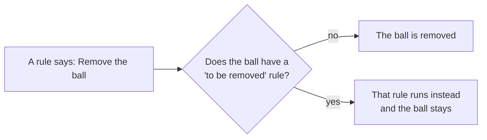

# Rules

Rules make a scene react while it runs. Each rule says **when** something
should happen and **what** should then be done, for example:

- *when* the ball enters the pocket, *then* remove the ball;
- *when* the cart's slider reaches its limit, *then* reverse its motor;
- *when* 5 seconds have passed, *then* set off the explosion.

Rules are kept in the **Rules** tab on the right. Press **+** to add one. A
new rule appears as a card, which you fill in from top to bottom.

## The rule card

The top line of a card holds its controls. The checkbox switches the rule on
or off without deleting it, which is handy while trying things out. The
triangle folds the card up to save space, and the bin deletes it. Double-click
the rule's name to rename it. The up and down arrows change the order; rules
are carried out in the order they are listed.

Below that, the card has three parts: **When**, **Then** and **Do**.

## More than one condition, more than one action

The **+** beside the **When** row adds another condition, and a small **and**
box appears between the two. Change it to **or** and the rule fires when any
one of them is true instead of when all of them are; it is one choice for the
whole card, so every gap shows the same word. Each condition after the first
has a button to take it away again.

The **+** beside the **Then** row does the same for actions: another **Then**
and **Do** pair, carried out in the order they are listed when the rule fires.
That is how one condition can set a property, perform an action and stop the
run without being written out three times.

A rule fires as the whole card *becomes* true, not once per condition -- so two
conditions joined with **and** fire once, when the second of them comes true.

Bear in mind that an event -- a touch, a sensor entered -- happens on a single
step and is gone. Joining a reading to an event with **and** is the useful case
("when the ball touches the ground *and* it is moving faster than 5"); joining
two events with **and** asks for both on the same step, which is rarely what
was meant.

The exporters write several readings and several actions without trouble. Two
events in one rule, or an event joined to a reading with **or**, have no single
place to live in the generated code, and the export says so in its report
rather than writing half the rule.

## Unfinished rules

A rule that still has a blank in it cannot run, and the card says so: it turns
red and a warning mark appears beside the name, with the missing piece named in
its tooltip. The Rules tab carries the same mark and a count, so an unfinished
rule is visible while you are working somewhere else.

An unfinished rule is kept like any other. It is saved with the scene and is
there again when the scene is reopened, so a rule half written at the end of one
session can be finished in the next. It is simply passed over while the scene
runs, and it is left out of an export.

## Variables

The **Variables** tab, next to Rules, holds values the scene carries that no
physics engine knows about: a score, a count of lives, a flag saying which way
a lift is going. Each has a name, a type -- **Boolean**, **Integer** or
**Double** -- and the value it starts every run at.

Rules reach them through a single object called **Variables**: pick it as the
thing watched or the thing acted on, and the variable itself is the property.
So *when Variables.score is greater than 100, stop the simulation* is written
the same way as any other rule.

A variable is run state. It starts each run at the value in the tab and goes
back there when the run stops, the way every shape goes back to where it
started.

**Add to Log** on the tab's toolbar shows the selected variable in the readout
pinned to the canvas, so you can watch it count while the scene runs; the same
offer is on the right-click menu, and the button says **Remove from Log** once
it is there.

Double-click a name to rename it, the way a rule card's title is renamed.
Renaming carries every rule and log row that named it along with it. Removing a
variable leaves the rules that used it marked unfinished, so nothing goes wrong
quietly.

## When: the condition

First choose the object the rule watches: a shape, a body, a joint, a ray,
or **World** for the simulation as a whole. Then choose what about it to
watch. This can be one of two things.

### A property compared with a value

For example, *ball · Speed · is less than · 5*, or *World · Elapsed Time ·
is at least · 10*. The comparisons are:

- **equals** and **differs from**,
- **is greater than** and **is less than**,
- **is at least** and **is at most**,
- **is a multiple of**. The value is rounded to a whole number, and the
  condition holds at every non-zero multiple: with 5, at 5, 10, 15 and so on.
  *World · Frame · is a multiple of · 60* fires once every 60 steps, which is
  once a second at the usual rate.

For on/off properties the choice is simply **is** or **is not**, true or false.

A rule fires at the moment its condition **becomes** true, not over and over
while it stays true. *Speed is less than 5* fires once when the ball slows
down, and fires again only if it speeds up and slows down once more.

### An event

An event is something that happens at a particular moment. Which events exist
depends on the object and on the [physics engine](engines.md):

- **begins contact** and **ends contact**: another shape starts or stops
  touching this one.
- **is hit**: something strikes this shape harder than the world's hit
  threshold.
- **is entered** and **is left**: something moves into or out of a
  [sensor](physics.md#sensors).
- **is about to touch**: two shapes are about to collide.
- **starts moving** and **comes to rest**: a body wakes up, or settles and
  falls asleep.
- **detects**: a [ray](physics.md#rays) sees a particular shape.
- **Lower limit reached** and **Upper limit reached**: a joint gets to the end
  of its range.
- **to be removed**: a rule is about to remove this body. See
  [Answering a removal](#answering-a-removal-to-be-removed).
- **starting simulation** (on **World**): happens once, at the start. See
  [Setting things up](#setting-things-up-starting-simulation).

Events that involve a second object, such as *begins contact*, have one more
box: which object it has to be. Choose *anything*, or name one in particular.

### Watching a value change

Two of the comparisons look at the step before as well:

- **changed to** fires on the step the reading *became* the value.
- **changed from** fires on the step it *stopped being* the value.

Both need the reading to have actually moved, so a value already sitting on the
target goes on being ignored, and neither fires on the first step of a run --
there is no step before it for anything to have changed from.

They compare exactly, which makes them worth using on readings that step
between settled values -- awake or asleep, a body type, how many things are in
a sensor, whether a ray is hitting anything. A position or a speed can pass
straight through a number between one step and the next without ever landing on
it, so **is greater than** is usually what is wanted there instead.

## Then: the target

Choose what the rule acts on:

- any object in the scene, by name;
- **the shape that touched it** or **the body that touched it**, which means
  the second object from the event. One rule on a pocket can remove whichever
  ball fell in;
- **World**, to change the simulation itself.

## Do: the change or the action

Choose either a property to change or an action to perform.

### Changing a property

Choose the property, then the operation:

- **Set to** gives the property a new value.
- **Increment by** counts it on from the value it already has.
- **Decrement by** counts it back down.
- **Negate** reverses its sign. This is the usual way to send a motor back
  the other way.
- **Toggle** switches an on/off property to the opposite state.

The value can be typed in directly, or read from another object while the
simulation runs: choose **Property** instead of **Value**, then name the
object, its property and an offset to add. This is how one object can follow
another, for example a platform that always stays 50 units below a ball.

### Performing an action

Actions do something rather than set a value. The ones that come with every
engine are:

- **Remove** takes a body out of the simulation for the rest of the run.
- **Init state** puts a body back where it stood when the simulation started,
  facing the same way and not moving.
- **Clone** makes a new body identical to this one, with all its body and
  shape properties, at the **X** and **Y** you give. It works even on a body
  that has already been removed. Clones exist only while the simulation runs
  and are never saved.
- **Explode** sets off an [explosion](physics.md#explosions).
- **Break** destroys a joint.
- **Stop the simulation** (on **World**) ends the run and puts the scene
  back, just like the Stop button.
- **Hold the simulation** (on **World**) pauses the run where it is.

Engines add their own actions, such as a push or a force at a point on a body,
or working out a body's mass again after its shapes have changed.

### Counting up and down

**Increment by** and **Decrement by** move the value the property already has
rather than replacing it, so a rule can count: a score going up by one each
time something is scored, a fuel level going down while a motor runs. Paired
with **changed to** on the thing being counted, that is a tally.

(**Increment by** is what used to be called **Add**; it is the same operation
under a name that says what it does. Files written either way still load.)

## Answering a removal: "to be removed"

Before a rule removes a body, Physalis checks whether that body has a rule of
its own with the event **to be removed**.

- If it has **none**, the body is removed as usual.
- If it **has** one, the removal is cancelled and that rule is carried out
  instead. The body stays in the simulation.

This lets general rules treat one object differently without writing a
separate rule for each case. If the answering rule itself removes the body,
the body really is removed.

**Example: a pool table.** Each pocket is a static sensor with one rule:
*pocket* **is entered** by *anything* → **the body that touched it** →
**Remove**. The cue ball has one rule of its own: *cue ball* **to be removed**
→ *cue ball* → **Init state**. Every other ball disappears into the pockets,
while the cue ball returns to where it started. Seven rules cover all six
pockets.

## Setting things up: "starting simulation"

A rule on **World** with the event **starting simulation** runs once, when
you press Simulate and before anything moves. Use it to prepare the scene,
for example to give a body a starting speed, place an object, or open a gate.
**Stop** puts back everything these rules changed, as it does for every other
rule.

## Tips

- Give meaningful names to the objects your rules use. The rule cards show
  names, and `ball` is easier to recognise than `circle_7`.
- To see why a rule does or does not fire, add the watched property to the log
  (right-click it in the Properties tab and choose **Add to Log**) and watch it
  during the run. A variable goes in the log from the Variables tab the same
  way.
- Untick a rule to switch it off for a moment instead of deleting it.
- A red card means the rule is unfinished, not that it is wrong: hover the
  warning mark to see which field is still empty.
