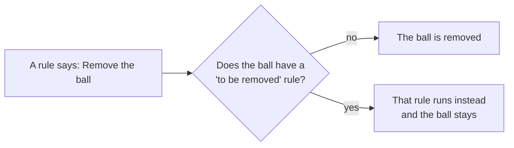

# Rules

Rules make things happen during a simulation: *when* something is true or
something happens, *then* change a property or perform an action.

Rules are in the **Rules** tab. Press **+** to add one.

## A rule card

### Header

| Control | What it does |
|---|---|
| Checkbox | Turns the rule on or off without deleting it |
| Triangle | Collapses or expands the card |
| Bin | Deletes the rule |
| Name | **Double-click** to rename the rule |
| Up / down arrows | Change the order. Rules are carried out in the order they are listed |

### When

Pick the object the rule watches, or **World** for the simulation itself. Then
pick either a property or an event.

**A property** is compared with a value:
*equals*, *differs from*, *is greater than*, *is less than*, *is at least*,
*is at most*, *is a multiple of*. For on/off properties the choice is *is* or
*is not*, true or false.

*Is a multiple of* rounds the property to a whole number and holds at every
non-zero multiple of the value: with 5, at 5, 10, 15 and so on. **Frame** *is a
multiple of* 60 fires once every 60 steps.

**An event** is something that happens:

| Event | On | Happens when |
|---|---|---|
| begins contact / ends contact | shapes | another shape starts or stops touching it |
| is hit | shapes | an impact above the world's hit threshold |
| is entered / is left | sensors | something enters or leaves the sensor |
| is about to touch | shapes | just before a collision is worked out |
| starts moving / comes to rest | bodies | the body wakes up or falls asleep |
| detects | rays | the ray sees a particular shape |
| to be removed | bodies and shapes | a rule is about to remove it (see below) |
| starting simulation | World | once, when the run starts |
| limit events | joints | a joint reaches one of its limits |

For events that involve another object (such as *begins contact*), a third box
asks **which** object: *anything*, or one in particular.

The World can also be watched by **Elapsed Time (s)** and **Frame**.

### Then

Pick what the rule changes:

- a named object,
- **the shape that touched it** or **the body that touched it**: the other
  object from the event,
- or **World**.

Then pick a property to change, or an action to perform.

### Do

For a property:

| Operation | Effect |
|---|---|
| **Set to** | sets the property to a value |
| **Toggle** | flips an on/off property |
| **Negate** | flips the sign. This is how a motor reverses at a limit |
| **Add** | adds a value to the property |

The value is either typed in (**Value**) or read from another object while the
run goes (**Property**). With Property, **Value from** chooses the object, its
property, and an offset to add.

## Actions

| Action | On | What it does |
|---|---|---|
| **Remove** | bodies, shapes | Takes the body out of the simulation for the rest of the run |
| **Init state** | bodies, shapes | Puts the body back where it was when the run started, facing the same way, not moving |
| **Clone** | bodies, shapes | Makes a new body with all the same body and shape properties, with its origin at **X** and **Y**. Works on a body already removed. The clone lasts until the run stops and is never saved |
| **Explode** | explosions | Sets off the blast |
| **Push at a Point** | bodies | An impulse at a point; off the centre it also turns the body |
| **Force at a Point (one step)** | bodies | A force for a single step |
| **Recalculate Mass** | bodies | Works out mass and inertia again from the shapes |
| **Break** | joints | Destroys the joint |
| **Stop the simulation** | World | Ends the run and puts the scene back |
| **Hold the simulation** | World | Pauses the run where it is |

## Answering a removal: "to be removed"

When a rule is about to remove a body, Physalis first looks for rules on that
body with the event **to be removed**.

- **No such rule:** the body is removed.
- **There is one:** the removal is cancelled and that rule is carried out
  instead. The body stays in the run.

If the answering rule itself removes the body, the body really is removed.

### Example: a pool table

- Each pocket is a **static sensor** with one rule:
  *pocket* **is entered** by *anything* → **the body that touched it** → **Remove**.
- The cue ball has one rule:
  *cue ball* **to be removed** → *cue ball* → **Init state**.

Every other ball disappears into a pocket. The cue ball goes back to where it
started, standing still. Seven rules cover all six pockets.

## Setting things up: "starting simulation"

A rule on **World** with the event **starting simulation** runs once, when you
press Simulate, before anything moves. Use it to set up the scene: give a body
a starting speed, place something, open a gate.

**Stop** still puts back everything these rules changed.

## Tips

- Name the shapes and bodies your rules use; the card shows names.
- Rules run in the order they are listed. Move them with the arrows.
- Untick a rule to switch it off while you try something.
