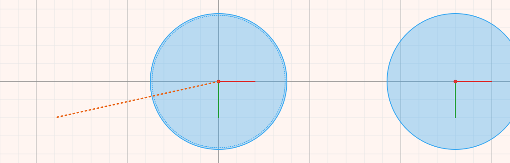

# Running a simulation

When the scene is ready, run it to see how it behaves. The controls are on
the toolbar in **Physics** mode.

## Starting, pausing and stopping

- **Simulate** (▶) starts the simulation. While it runs, the same button
  pauses it, and pressing it again carries on.
- **Step** moves the simulation on by a single frame and then holds it. Step
  through a collision frame by frame to see exactly what happens.
- **Stop** (■) ends the simulation and puts every body back exactly where it
  was before you started. Nothing that happened during the run is kept, so you
  can run a scene as many times as you like.

While a simulation runs, the scene cannot be edited. You can still move the
view by dragging the canvas, zoom, look at values in the Properties tab, and
fling bodies with the [slingshot](#the-slingshot).

## Playback speed

The **×1** box sets how fast the simulation plays, from ×¼ to ×8. At ×2, two
seconds of the simulation pass in one second of real time. Only the pace
changes: the physics is calculated in the same way at every speed, so a scene
ends the same whether you watch it slowly or quickly.

## What is shown during a run

The **View** list chooses which helpers are drawn while the simulation runs.
Tick any combination:

- **Grid**, the background grid;
- **Joints**, the joints and their anchors;
- **Body axes**, the centre-of-mass cross on each body;
- **Rays** and **Explosions**;
- **Sleep shading**, which tints each body by whether the engine is still
  calculating it or has put it to sleep because it has come to rest.

These choices affect only the running simulation. While you edit, everything
is always drawn, because that is when you need to see and place it.

## Full screen

With **Full Screen** ticked, Simulate opens the simulation in a window of its
own that fills the screen, with the field as large as it fits. The keys there
are:

- **Space** holds the simulation, and releases it again;
- **→** (right arrow) moves on by one frame while it is held;
- **Esc** ends the simulation and returns to the editor.

Drag to move the view, turn the mouse wheel to zoom, and press **0** to fit the
whole field again.

## Watching values

To follow a value while the simulation runs, such as a ball's speed, a
joint's angle or the time elapsed, right-click its name in the Properties tab
and choose **Add to Log**. Logged values are listed in the top-left corner of
the canvas while the simulation runs, each with the name of its object, and
they update every frame. Right-click a logged property again and choose
**Remove from Log** to stop watching it, or **Clear Log** to remove them all.

The log is also the quickest way to find out why a [rule](rules.md) does or
does not fire: watch the value the rule compares.

## The slingshot

Any dynamic body can be flung with the mouse during a run, like a ball hit with
a pool cue. First tick **Can Be Shot** on the body's **Body** page. Then, during
the simulation:

1. Press the mouse button on the body.
2. Pull back. A line runs from the body to the pointer, and its colour changes
   from the light-pull colour to the full-pull colour as the pull grows.
3. Let go. The body is pushed in the opposite direction, through its centre of
   mass, harder the further you pulled.

Press **Esc**, or click the right mouse button while pulling, to cancel.

Two settings on the body decide how strong the shot is:

- **Max Power** is the push at full pull.
- **Max Pull** is how far you have to pull, in field units, for full power.
  Pulling further adds nothing.

A body that can be shot has a dotted line just inside its outline, so it is easy
to recognise. A shot reaches through shapes that cannot be shot, so a ball
lying under a table can still be fired. The colours, width and style of the
pull line are set in [Options → Physics](options.md).

## When something goes wrong

A scene may ask the engine for something impossible, such as a motor thousands
of times stronger than what it drives. Instead of crashing, Physalis takes the
body that has run out of control out of the simulation and reports what
happened in the status bar. Press **Stop** to put the scene back, then reduce
the value that caused the problem.
